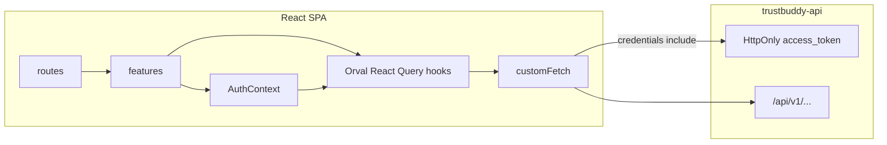

# Trustbuddy Frontend — Architecture

Vite + React CSR SPA for the multi-step insurance quote flow. Pairs with [trustbuddy-api](https://github.com/aegre/trustbuddy-api). Delivery phases live in [BUILD_JOURNEY.md](BUILD_JOURNEY.md); agent rules in [AGENTS.md](AGENTS.md).

## Principles

- **Thin routes** — `src/routes/` owns URL wiring and auth redirects only; UI and domain live in `features/`.
- **Feature modules** — vertical slices (`auth`, `quotes`, `wizard`, `common`) own screens, forms, and schemas.
- **Shared API spine** — Orval-generated React Query clients + models; `customFetch` mutator with cookie credentials; DTO aliases in `types.ts`.
- **Split state** — TanStack Query (via Orval hooks) owns server state; React Context owns UI/auth session flags only.
- **Cookie auth** — JWT stays in an HttpOnly cookie; never in `localStorage` / `sessionStorage`.

## Request flow



### Auth

1. Login form → Orval `token` / `useToken` → `POST /api/v1/auth/token` (cookie set by API).
2. On app load, `AuthProvider` calls `GET /api/v1/auth/me` (cookie credentials) to restore the session after refresh.
3. `AuthContext` records logged-in / loading / username for the UI (not the JWT).
4. Later API calls use `credentials: 'include'` via `customFetch`.
5. Logout → Orval logout operation clears the cookie and context.

### Quotes / wizard

1. List/detail via Orval React Query hooks under `src/api/generated/quotes/`.
2. Wizard steps use the same generated mutations; invalidate list/detail on success.
3. Wizard URL: `/wizard/:stepSlug?quoteId=` (`personal` | `coverage` | `review`).
4. Submit (`POST .../submit`) from Review → `/success?quoteId=`. `SUBMISSION_FAILED` quotes stay form-locked but can retry submit on Review.

## Folder layout

```
src/
  api/
    config.ts
    mutator/custom-fetch.ts   # Orval mutator (credentials: include)
    types.ts                  # DTO aliases — public import surface
    generated/                # Orval output (committed)
      model/
      authentication/
      quotes/
  features/
    common/            # theme, shared UI
    auth/              # login, AuthContext
    quotes/            # list UI
    wizard/            # steps, forms, schemas, guards
  routes/              # thin route elements — no domain logic
  test/
    setup.ts
    msw/               # compose Orval *.msw.ts handlers
    factories/
```

Feature subfolders are created only when files appear:

| Subfolder     | Purpose                                                   |
| ------------- | --------------------------------------------------------- |
| `components/` | Feature UI; wizard uses `steps/*-step.tsx` + `*-form.tsx` |
| `screens/`    | Full-page composition                                     |
| `layouts/`    | Feature chrome / providers                                |
| `context/`    | React context (auth, wizard UI-only)                      |
| `hooks/`      | Feature hooks (thin wrappers over Orval when useful)      |
| `types/`      | Domain registries (e.g. wizard steps)                     |
| `utils/`      | Pure helpers, guards, href builders                       |
| `schemas/`    | Yup form schemas aligned with request DTOs                |

## Layer rules

| Layer                   | May depend on                                       | Must not                                                       |
| ----------------------- | --------------------------------------------------- | -------------------------------------------------------------- |
| `routes/`               | `features/*` screens/layouts                        | Call API or hold Yup/business rules                            |
| `features/*/components` | schemas, hooks, context, `@/api/types`, Orval hooks | Import generated model files instead of `@/api/types` for DTOs |
| `api/mutator`           | env/config, fetch                                   | Feature UI                                                     |
| `api/generated`         | Orval output only — regenerate, do not hand-edit    | —                                                              |
| `test/msw`              | Orval `*.msw.ts`, factories                         | Live in production feature paths                               |

## OpenAPI / Orval

1. Sync contract from trustbuddy-api → local `openapi/openapi.json` (gitignored).
2. Run Orval (`make openapi-codegen`) → `src/api/generated/**` (committed).
3. Expose DTO aliases from `src/api/types.ts`.
4. Tests can reuse generated MSW handlers from `*.msw.ts`.

## Testing boundary

- **Vitest + MSW** — unit/component tests; prefer Orval-generated handlers.
- **Playwright** — critical E2E paths (login, wizard submit).
- Do not mock API responses inside the running app; MSW is for tests only.

## Local runtime

- Frontend: Vite dev server (`make run` / `npm run dev`).
- Backend: trustbuddy-api on `http://localhost:8080` with CORS allowing the frontend origin.
- Env: `VITE_API_BASE_URL` (see `.env.example`).
