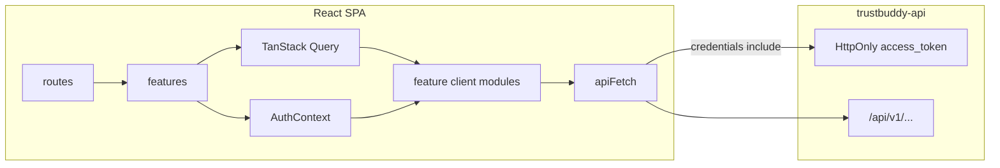

# Trustbuddy Frontend — Architecture

Vite + React CSR SPA for the multi-step insurance quote flow. Pairs with [trustbuddy-api](https://github.com/aegre/trustbuddy-api). Delivery phases live in [BUILD_JOURNEY.md](BUILD_JOURNEY.md); agent rules in [AGENTS.md](AGENTS.md).

## Principles

- **Thin routes** — `src/routes/` owns URL wiring and auth redirects only; UI and domain live in `features/`.
- **Feature modules** — vertical slices (`auth`, `quotes`, `wizard`, `common`) own their screens, forms, schemas, and API wrappers.
- **Shared API spine** — one browser `apiFetch` + OpenAPI DTO aliases; feature `client/` modules stay thin wrappers.
- **Split state** — TanStack Query owns server state (quotes, mutations, cache); React Context owns UI/auth session flags only.
- **Cookie auth** — JWT stays in an HttpOnly cookie; never in `localStorage` / `sessionStorage`.

## Request flow



### Auth

1. Login form → `POST /api/v1/auth/token` (cookie set by API).
2. `AuthContext` records logged-in / loading for the UI.
3. Later API calls use `credentials: 'include'` so the browser sends the cookie.
4. Logout → `POST /api/v1/auth/logout` clears the cookie and context.

### Quotes / wizard

1. List and detail load through TanStack Query → feature `client/` → `apiFetch`.
2. Wizard steps mutate via the same clients; Query invalidates list/detail on success.
3. Wizard URL: `/wizard/:stepSlug?quoteId=` (`personal` | `coverage` | `review`).

## Folder layout

```
src/
  api/                 # shared HTTP spine only
    config.ts
    client.ts          # apiFetch (credentials: 'include')
    errors.ts
    types.ts           # DTO aliases — public import surface
    generated/
      schema.ts        # openapi-typescript output (committed)
  features/
    common/            # theme, shared UI
    auth/              # login, AuthContext, auth client
    quotes/            # list UI + client
    wizard/            # steps, forms, schemas, guards, client
  routes/              # thin route elements — no domain logic
  test/
    setup.ts
    msw/
    factories/
```

Feature subfolders are created only when files appear:

| Subfolder     | Purpose                                                   |
| ------------- | --------------------------------------------------------- |
| `components/` | Feature UI; wizard uses `steps/*-step.tsx` + `*-form.tsx` |
| `screens/`    | Full-page composition                                     |
| `layouts/`    | Feature chrome / providers                                |
| `context/`    | React context (auth, wizard UI-only)                      |
| `hooks/`      | Feature hooks (including Query wrappers)                  |
| `types/`      | Domain registries (e.g. wizard steps)                     |
| `utils/`      | Pure helpers, guards, href builders                       |
| `schemas/`    | Yup form schemas aligned with request DTOs                |
| `client/`     | Thin endpoint wrappers over `apiFetch`                    |

## Layer rules

| Layer                   | May depend on                                 | Must not                              |
| ----------------------- | --------------------------------------------- | ------------------------------------- |
| `routes/`               | `features/*` screens/layouts                  | Call API or hold Yup/business rules   |
| `features/*/components` | schemas, hooks, context, `@/api/types`        | Import generated `schema.ts` directly |
| `features/*/client`     | `@/api/client`, `@/api/types`, `@/api/errors` | Own React state or UI                 |
| `api/`                  | env/config, fetch                             | Feature UI or Query hooks             |
| `test/msw`              | OpenAPI-shaped fixtures                       | Live in production feature paths      |

## OpenAPI types

1. Sync contract from trustbuddy-api → local `openapi/openapi.json` (gitignored).
2. Generate `src/api/generated/schema.ts` (committed).
3. Expose aliases only from `src/api/types.ts`.
4. App code imports `@/api/types` — never generated paths/operations elsewhere.

## Testing boundary

- **Vitest + MSW** — unit/component tests intercept real `client/` → `apiFetch` HTTP.
- **Playwright** — critical E2E paths (login, wizard submit).
- Do not mock API responses inside the running app; MSW is for tests only.

## Local runtime

- Frontend: Vite dev server (see Makefile / `npm run dev` once wired).
- Backend: trustbuddy-api on `http://localhost:8080` with CORS allowing the frontend origin.
- Env: `VITE_API_BASE_URL` (see `.env.example` when added).
