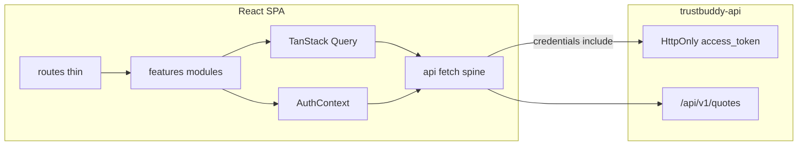

# Trustbuddy Frontend — Phase Build Plan

Greenfield app in [trustbuddy-frontend](.) against the feature-complete [trustbuddy-api](https://github.com/aegre/trustbuddy-api). Stack and phase order follow [README.md](README.md). Functionality over polish until phase 9.

## Architecture (locked)



| Concern | Choice |
|---------|--------|
| Auth | Cookie JWT — `POST /api/v1/auth/token` + `credentials: 'include'`; Context only tracks logged-in / loading |
| Server state | TanStack Query calling feature `client/` wrappers |
| UI/auth state | React Context under `features/*/context/` |
| Types | `openapi-typescript` → `src/api/generated/schema.ts`; import DTOs only via `@/api/types` |
| Testing | Vitest + MSW (`src/test/msw/`, factories); Playwright for critical E2E |
| Docker | Container runs the React app (Vite/Node), per README |

## Folder structure

Feature-sliced modules with a thin route layer and a shared API spine. Create subfolders only when files appear (no empty placeholders).

```
src/
  api/                 # shared HTTP spine only
    config.ts
    client.ts          # browser apiFetch with credentials: 'include'
    errors.ts
    types.ts           # DTO aliases — only public import surface for schemas
    generated/
      schema.ts        # committed codegen output
  features/
    common/            # theme, AppThemeProvider, shared UI
    auth/              # login screen, schemas, client, AuthContext
    quotes/            # list UI + client
    wizard/            # steps, forms, schemas, guards, client, optional UI context
  routes/              # thin route elements / loaders — no domain logic
  test/
    setup.ts
    msw/
    factories/
```

**Feature subfolders:**

| Subfolder | Purpose |
|-----------|---------|
| `components/` | Feature UI (forms, cards, shells); wizard: `steps/*-step.tsx` + `*-form.tsx` |
| `screens/` | Full-page composition (e.g. login) |
| `layouts/` | Feature chrome / providers |
| `context/` | React context (auth, wizard UI-only) |
| `hooks/` | Feature hooks (Query wrappers OK here) |
| `types/` | Domain registries (wizard steps) |
| `utils/` | Pure helpers, step guards, href builders |
| `schemas/` | Yup form schemas aligned with request DTOs |
| `client/` | Thin API endpoint wrappers over `apiFetch` |

**Routes (target):** `/login` · `/` (quotes list) · `/wizard/:stepSlug?quoteId=` with steps `personal` | `coverage` | `review` · success after submit.

**OpenAPI workflow:** `make openapi-sync` / `openapi-codegen` / `openapi-update` from `../trustbuddy-api/openapi/openapi.json`; gitignore local `openapi/openapi.json`; commit `src/api/generated/schema.ts`.

**AGENTS.md:** Document stack, folder rules, path alias `@/`, DTO-only-via-`types.ts`, Yup aligned with DTOs, Context vs Query, cookie auth (no JWT in storage), and `make verify`.

---

## Phase 1 — Initial setup

**Deliverables**
- Scaffold Vite + React + TypeScript; deps: MUI, React Router, RHF, Yup, TanStack Query, openapi-typescript
- Create folder spine above; `@/` alias; ESLint/Prettier; Husky + lint-staged
- `Makefile`: `install`, `dev`, `build`, `test`, `lint`, `format`, `verify`, `openapi-*`, `docker-*`
- `AGENTS.md` + thin `CLAUDE.md` pointing at it
- OpenAPI codegen + `apiFetch` + `errors` + `types` facade
- Vitest + MSW + Testing Library; Playwright stub; `src/test/` layout
- Dockerfile; `.env.example` (`VITE_API_BASE_URL`); expand `.gitignore`

**Done when:** `make dev` / `make verify` work; generated schema committed; empty smoke test passes.

---

## Phase 2 — Login screen

**Deliverables** (under `features/auth/`)
- `client/auth.ts` → token + logout
- Yup `schemas/` + login form/screen; `AuthContext` for session UI state
- Thin `routes/` for `/login` + protected outlet
- MSW auth handlers; Vitest form + login flow; Playwright login happy path

**API:** `POST /api/v1/auth/token`, `POST /api/v1/auth/logout`

**Done when:** Cookie session established; logout clears; unauthenticated users redirected.

---

## Phase 3 — Dashboard / list of quotes

**Deliverables** (under `features/quotes/`)
- `client/` list + Query hook; table/list UI (fixed page/size for now)
- Columns: name, email, status, premium, dates; empty/loading/error
- CTA → `/wizard/personal` (new); row → `/wizard/personal?quoteId=`
- MSW list fixture + component test

**Done when:** Logged-in user sees quotes from API (or MSW in tests).

---

## Phase 4 — Wizard setup

**Deliverables** (under `features/wizard/`)
- Step registry + stepper layout; routes `/wizard/:stepSlug`
- `utils/step-guards`, `utils/wizard-href`
- Quote loaded via Query `['quote', quoteId]`; UI-only context if needed
- Stub step components; DRAFT-only edit guards; code-split wizard routes

**Done when:** Step navigation + chrome work without real forms.

---

## Phase 5 — Wizard personal data step

**Deliverables**
- `schemas/` + `components/steps/personal-step.tsx` + `personal-form.tsx`
- New: `POST /api/v1/quotes` then set `quoteId` in URL; edit: `PATCH /api/v1/quotes/{id}`
- Prefill from detail Query; handle **409**
- MSW create/update tests

**Done when:** User creates/updates personal info and advances with a real `quoteId`.

---

## Phase 6 — Wizard coverage step

**Deliverables**
- Coverage/health form + senior conditionals (age > 65)
- `PATCH .../coverage`; show `estimatedMonthlyPremium` from response
- Continue gated on required fields (mirror API submit rules where practical)

**Done when:** Coverage persists and premium updates on screen.

---

## Phase 7 — Confirmation + success

**Deliverables**
- Review step summary; `POST .../submit`
- Success screen; retry on `SUBMISSION_FAILED`; **409** messaging
- Invalidate list/detail queries; Playwright full happy path

**Done when:** Draft → submitted path works end-to-end.

---

## Phase 8 — Pagination on dashboard

**Deliverables**
- Wire `page` / `size` (optional sort) to `PageQuoteResponse`
- MUI pagination; Query keys include page params; tests

**Done when:** Large lists paginate correctly.

---

## Phase 9 — UI tweaks

**Deliverables**
- Polish via `features/common` theme; loading/empty/error consistency
- Stepper/form/dashboard density; auth edge cases; basic a11y
- README / AGENTS “run against local API” notes

**Done when:** Flow feels coherent; no new features beyond polish.

---

## Cross-cutting (every phase)

- Colocate `*.test.ts(x)` next to code; MSW intercepts real `client/` → `apiFetch` path
- Never store JWT in `localStorage`/`sessionStorage`
- CORS: frontend origin in API `CORS_ALLOWED_ORIGINS`; API at `http://localhost:8080`
- After each phase: short progress note (`BUILD_JOURNEY.md` or README checklist)

## Out of scope until later

- Visual redesign / marketing pages
- Bearer-token-in-header browser flow (cookie path only)
- Reordering phases (pagination stays phase 8 per README)
