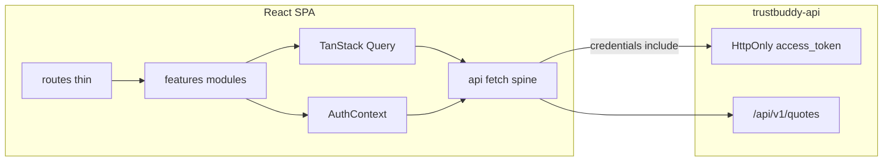

# Trustbuddy Frontend — Phase Build Plan

Greenfield app in [trustbuddy-frontend](.) against the feature-complete [trustbuddy-api](https://github.com/aegre/trustbuddy-api). Stack and phase order follow [README.md](README.md). Functionality over polish until phase 9.

## Architecture (locked)



| Concern       | Choice                                                                                                     |
| ------------- | ---------------------------------------------------------------------------------------------------------- |
| Auth          | Cookie JWT — `POST /api/v1/auth/token` + `credentials: 'include'`; Context only tracks logged-in / loading |
| Server state  | TanStack Query via Orval-generated hooks                                                                   |
| UI/auth state | React Context under `features/*/context/`                                                                  |
| Types         | Orval → `src/api/generated/` (models, React Query hooks, MSW); import DTOs via `@/api/types`               |
| Testing       | Vitest + MSW (`src/test/msw/`, Orval `*.msw.ts` handlers, factories); Playwright for critical E2E          |
| Docker        | Container runs the React app (Vite/Node), per README                                                       |

## Folder structure

Feature-sliced modules with a thin route layer and a shared API spine. Create subfolders only when files appear (no empty placeholders).

```
src/
  api/
    config.ts
    mutator/custom-fetch.ts   # Orval mutator (credentials: include)
    types.ts                  # DTO aliases — public import surface
    generated/                # Orval output (committed)
      model/
      authentication/
      quotes/
  features/
    common/            # theme, AppThemeProvider, shared UI
    auth/              # login screen, schemas, AuthContext
    quotes/            # list UI
    wizard/            # steps, forms, schemas, guards, optional UI context
  routes/              # thin route elements / loaders — no domain logic
  test/
    setup.ts
    msw/               # compose Orval *.msw.ts handlers
    factories/
```

**Feature subfolders:**

| Subfolder     | Purpose                                                                                         |
| ------------- | ----------------------------------------------------------------------------------------------- |
| `components/` | Feature UI (forms, cards, shells); wizard: `steps/*-step.tsx` + `*-form.tsx`                    |
| `screens/`    | Full-page composition (e.g. login)                                                              |
| `layouts/`    | Feature chrome / providers                                                                      |
| `context/`    | React context (auth, wizard UI-only)                                                            |
| `hooks/`      | Feature hooks (Query wrappers OK here)                                                          |
| `types/`      | Domain registries (wizard steps)                                                                |
| `utils/`      | Pure helpers, step guards, href builders                                                        |
| `schemas/`    | Yup form schemas aligned with request DTOs                                                      |
| `client/`     | Prefer Orval-generated hooks under `src/api/generated/`; keep feature wrappers only when needed |

**Routes (target):** `/login` · `/` (quotes list) · `/wizard/:stepSlug?quoteId=` with steps `personal` | `coverage` | `review` · success after submit.

**OpenAPI workflow:** `make openapi-sync` / `openapi-codegen` / `openapi-update` from `../trustbuddy-api/openapi/openapi.json`; gitignore local `openapi/openapi.json`; commit `src/api/generated/**` (Orval).

**AGENTS.md:** Document stack, folder rules, path alias `@/`, DTO-only-via-`types.ts`, Yup aligned with DTOs, Context vs Query, cookie auth (no JWT in storage), and `make verify`.

---

## Phase 1 — Initial setup

**Status:** Phase 1 setup complete on `feat/phase-1-setup` (no PR yet). Ready for Phase 2 login work.

### Done

- [x] `AGENTS.md`, `ARCHITECTURE.md`, `CLAUDE.md` (#4)
- [x] GitHub PR template (#4)
- [x] Dockerfile + compose + `.env.example` + Makefile docker targets (#4)
- [x] Oxlint (React, jsx-a11y, react-perf) + Prettier (#4)
- [x] Expanded `.gitignore` for env/build artifacts (#4)
- [x] App stack deps: MUI, React Router, RHF, Yup, TanStack Query
- [x] Orval codegen (React Query + MSW) + `customFetch` mutator + `@/api/types` facade
- [x] Makefile / npm `openapi-sync` / `openapi-codegen` / `openapi-update`
- [x] `@/` path alias (Vite + TypeScript, no deprecated `baseUrl`)
- [x] Docs updated for Orval (`AGENTS.md`, `ARCHITECTURE.md`, this plan)
- [x] Feature folder spine: `src/features/{common,auth,quotes,wizard}`, `src/routes/`, `src/test/`
- [x] Husky + lint-staged
- [x] Makefile `install`, `test`, `verify`, and `dev` alias for `run`
- [x] Vitest + Testing Library + Playwright stub; smoke test so `make verify` passes
- [x] Wire Orval MSW handlers into `src/test/msw/`
- [x] Shared `api` errors helper (`src/api/errors.ts`)
- [x] GitHub Actions PR validation (`make verify` + Docker build)

**Done when:** `make run` / `make verify` work; generated API clients committed; empty smoke test passes. ✅

---

## Phase 2 — Login screen

**Status:** In progress on `feat/phase-2-login-screen`.

**Deliverables** (under `features/auth/`)

- [x] Orval `token` / `logout` wired via `AuthContext` (imperative clients; generated `useToken`/`useLogout` are queries)
- [x] Yup `schemas/` + login form/screen (submit callback)
- [x] `AuthContext` for session UI state (`isAuthenticated` / `isPending` / `login` / `logout`)
- [x] Thin `routes/` for `/login` + protected outlet (+ mount `AuthProvider`)
- [ ] Vitest form + login flow; Playwright login happy path

**API:** `POST /api/v1/auth/token`, `POST /api/v1/auth/logout`

**Done when:** Cookie session established; logout clears; unauthenticated users redirected.

---

## Phase 3 — Dashboard / list of quotes

**Status:** Done (merged).

**Deliverables** (under `features/quotes/`)

- [x] List + Query hook via Orval `useListQuotes` (`useQuotesList` wrapper; fixed page/size)
- [x] table/list UI (columns: name, email, status, premium, dates; empty/loading/error)
- [x] CTA → `/wizard/personal` (new); row → `/wizard/personal?quoteId=`
- [x] MSW list fixture + component test (hook + screen tests + factories)

**Done when:** Logged-in user sees quotes from API (or MSW in tests).

---

## Phase 4 — Wizard setup

**Status:** In progress on `feat/phase-4-wizard-shell`.

**Deliverables** (under `features/wizard/`)

- [x] Step registry + stepper layout; routes `/wizard/:stepSlug`
- [x] `utils/step-guards`, `utils/wizard-href`
- [ ] Quote loaded via Query `['quote', quoteId]`; UI-only context if needed
- [x] Stub step components; code-split wizard routes
- [ ] DRAFT-only edit guards

**Done when:** Step navigation + chrome work without real forms.

---

## Phase 5 — Wizard personal data step

**Deliverables**

- `schemas/` + `components/steps/personal-step.tsx` + `personal-form.tsx`
- New: `POST /api/v1/quotes` then set `quoteId` in URL; edit: `PATCH /api/v1/quotes/{id}`
- Prefill from detail Query; handle **409**
- MSW create/update tests

**Done when:** User creates/updates personal info and advances with a real `quoteId`.

---

## Phase 6 — Wizard coverage step

**Deliverables**

- Coverage/health form + senior conditionals (age > 65)
- `PATCH .../coverage`; show `estimatedMonthlyPremium` from response
- Continue gated on required fields (mirror API submit rules where practical)

**Done when:** Coverage persists and premium updates on screen.

---

## Phase 7 — Confirmation + success

**Deliverables**

- Review step summary; `POST .../submit`
- Success screen; retry on `SUBMISSION_FAILED`; **409** messaging
- Invalidate list/detail queries; Playwright full happy path

**Done when:** Draft → submitted path works end-to-end.

---

## Phase 8 — Pagination on dashboard

**Deliverables**

- Wire `page` / `size` (optional sort) to `PageQuoteResponse`
- MUI pagination; Query keys include page params; tests

**Done when:** Large lists paginate correctly.

---

## Phase 9 — UI tweaks

**Deliverables**

- Polish via `features/common` theme; loading/empty/error consistency
- Stepper/form/dashboard density; auth edge cases; basic a11y
- README / AGENTS “run against local API” notes

**Done when:** Flow feels coherent; no new features beyond polish.

---

## Cross-cutting (every phase)

- Colocate `*.test.ts(x)` next to code; MSW intercepts real `client/` → `apiFetch` path
- Never store JWT in `localStorage`/`sessionStorage`
- CORS: frontend origin in API `CORS_ALLOWED_ORIGINS`; API at `http://localhost:8080`
- After each phase: short progress note (`BUILD_JOURNEY.md` or README checklist)

## Out of scope until later

- Visual redesign / marketing pages
- Bearer-token-in-header browser flow (cookie path only)
- Reordering phases (pagination stays phase 8 per README)
